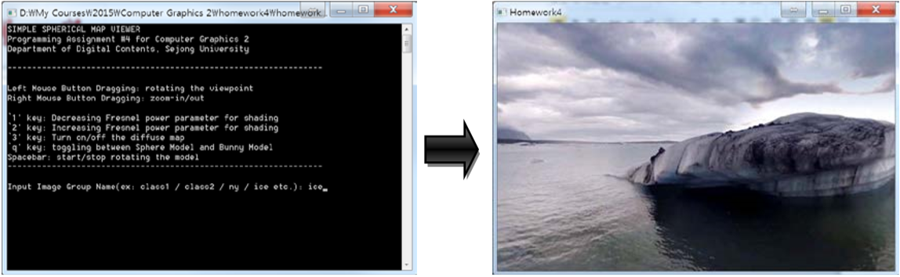
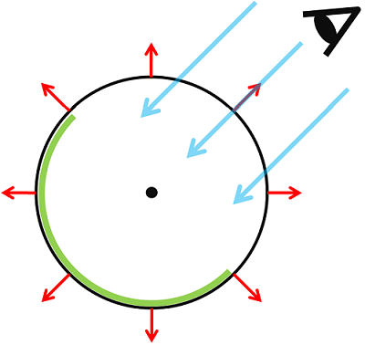

# Graphics2-4  
Graphics2 Homework4: Spherical Map Viewer  
  
---
  
### Spherical Map Viewer 만들기  
주어진 360도 카메라로부터 얻은 360도 사진들을 이용한 환경맵핑 기법을 구현하라.  
이러한 효과 는 주어진 이미지를 구면(sphere)에 배치시킴을 통해 얻을 수 있다.  


 
### 프로그램 구동에 필요한 파일들  
토끼 모델 정보인 bunny.obj 와 환경맵핑에 사용되는 tga 파일들 각 tga파일은 2개씩 있으며  
각 파일은 ＊_spheremap.tga, ＊_diffusemap.tga 의 형태를 띈다. (＊은 image group name)  
각 파일의 의미는 다음과 같다.  
  - groupname_spheremap.tga 이미지는 360도 카메라 이미지이며 환경맵핑에 사용된다.
  - groupname_diffusemap.tga 이미지는 위 이미지를 blur한 이미지로  
  가상 물체의 diffuse color를 결정하는 조명이미지(light map)로 활용한다. 


### 1. Spherical Image
  - 다음과 같이 이미지 그룹의 이름 (예를 들어 class1, class2, ny 등)을 입력하면,  
    두 개의 이 미지 groupname_spheremap.tga, groupname_diffusemap.tga를 읽는다.
  - 그 중 groupname_spheremap.tga를 구면에 맵핑하여 다음 사진과 같이 주변을 표시한다.  
      
  
  
### 2. Viewing
  - 마우스 조작을 통해 주변을 둘러볼 수 있다.
  - 마우스 조작 구현은 주변을 회전시키는 것이 아니라, 카메라(시점)의 위치와 방향을 바꿔 줌으로써 얻을 수 있다.  
  - 왼쪽 마우스 드래깅 조작은 좌우 위아래를 둘러볼 수 있게 카메라를 조작한다.  
  - 오른쪽 마우스 드래깅 조작은 카메라를 가까이 또는 멀게 하여 줌인/줌아웃 효과를 준다. 
    


### 3. Fresnel Shading   
  - ‘q’키를 누르면 구와 토끼 모델이 번갈아 나온다.  
  - ‘1’키를 누르면 Fresnel power 값이 감소하며, ‘2’키를 누르면 Fresnel power 값이 증가한다.  
  - Fresnel 효과 구현을 위해서는 다음과 같은 식을 fragment shader에 활용하면 된다. 
    ```
    float F = 0.0;  
    float ratio = F+(1.0-F)*pow((1.0+dot(wV, wN)), FresnelPower);  
    if(FresnelPower>10) ratio = 0; // 10보다 클경우 반사 없음  
    fColor = mix(phong_color, reflect_color, ratio);
    ```
      


### 4. Diffuse Map  
  - diffuse 색 성분은 조명의 난반사로부터 나온다.  
  - 사실적인 렌더링을 위해서는 조명을 예상할 필요가 있으며,  
  수업에서는 가상의 점조명을 가정하여 사용하였으나, 최근에는 가상의 조명을 사용하지 않고,  
  360도 사진을 이용하여 조명을 예상하여 렌더링한다.  
  (이를 Image Based Lighting 기법이라 한다) 
  - 주어진 groupname_diffusemap.tga는 360도 사진을 blur 한 이미지로  
  diffuse의 난반사 효 과를 흉내 내는 데 사용될 수 있으며, 이러한 사진을 diffuse light map이라 부른다.  
  - 구현방법 : diffusemap 이미지를 또 다른 환경맵핑처럼 생각하여,  
  물체 표면의 법선 벡터 방향이 가 르키는 곳의 색을 얻어오고  
  이를 물체의 diffuse color를 결정하는 조명값으로 활용한다.  
  - ‘3’번 키를 누르면 diffuse light map 사용을 끄거나 킬 수 있다.  
      

---


### 구현 설명  
### 1. Spherical Image
sphere에다 지구와 귤에 이미지 씌운것 처럼 텍스쳐이미지를 맵핑하고 Scale 매트릭스를 이용해서 크기를 10배로 늘렸다.  
카메라가 sphere의 표면보다 안쪽으로 들어가면, sphere의 내부가 보이고 spherical image가 된다.  
Sphere의 표면에 텍스쳐이미지를 입히고 안에서 바라보기 때문에 좌우가 뒤집혀있어서  
텍스쳐 좌표를 최대값인 1에서 현재값을 빼는 식으로 수정했다.(tex.x = 1.0 - tex.x;)  
  
또한 카메라가 표면보다 멀리가면 기존 수업시간에 지구, 귤 등을 맵핑한 것 처럼 바깥쪽이 보이기 때문에  
normal 값과  원점을 바라보는 벡터(V)가 반대방향이면 그리도록 구현했다. 


### 2. Viewing  
마우스의 상태를 알 수 있는 mouse 이벤트와 마우스의 현재 움직임을 알 수 있는 motion 이벤트를 이용했다.  
마우스 왼쪽버튼을 p1에 좌표를 저장하고,  
왼쪽버튼이 눌린 상태에서 움직이면 실시간으로 x, y의 변화량을 찾기 위해 p2좌표를 저장한 뒤 p1에 p2값을 저장한다.  

  
마우스 이동에 따른 화면 이동은 처음에는 오일러앵글을 생각해서 RotateX, RotateY, RotateZ를 생각했는데,  
이렇게하면 x,y,z를 동시에 이동했을 때 표현이 어려워서 다른 방향으로 생각해봤다.  
그래서 카메라가 바라보는 물체와 일정거리를 유지하고 움직이기 때문에  
상하좌우로 움직일 때 구의 표면을 따라 움직인다고 생각하고 구현했다.  
카메라가 이동한 위치의 x-z평면 값은 위의 그림과 같이 마우스 좌표의 변화량을 가지고 삼각함수를 이용해서 구했다.  
y값은 이동값을 그대로 가져온다. x,y,z 세 값을 vec3 형식으로 저장한다.  
그리고 normalize를 해서 길이를 1로 만든 뒤 반지름의 음수값 만큼(-r)을 곱했다. 
  
화면 확대 및 축소는 이 반지름값을 이용해서 조절했다.  
반지름값이 작아지면 카메라가 가까워지면서 화면 확대가 되고,  
반지름값이 커지면 카메라가 멀어지면서 화면 축소가 된다.  
변경된 r값을 normalize된 카메라 위치에 곱해준다.  


### 3. Fresnel Shading  
수업시간에 reflect함수를 이용해 반사된 벡터를 구하는 것 까지 했다.  
이 벡터가(direction) 주어지면 텍스쳐이미지의 u, v 좌표로 변환시켜 색을 가져오는 함수를 구현해야했다.
  
  
direction 벡터는 -1부터 1사이의 값이고 texture 좌표는 0부터 1사이의 값이다.  
arctan과 acos를 이용해 각도를 구했고 이 각도를 2pi로 나눴다.  
이렇게하면 제대로 나올 줄 알았는데 1/4정도 돌아간 모습으로 그려져서  
최대한 비슷하게 그리기 위해 좌표를 약간씩 더해줬다.  
dir1.z가 0보다 작으면 u값에 1/4을 더하고, 0보다 크면 3/4을 더했다.  


### 4. Diffuse Map  
diffuse map은 3번 shader에서 phong color대신 diffuse 텍스쳐 이미지의 색을 가져오는 방식으로 구현했다.  
sphere에 텍스쳐를 씌운것처럼 이미지를 아예 덮어버리고 fresnel color를 섞을까 하다가  
시점을 움직이면 같이 따라서 움직여야하기 때문에 앞에서 짠 코드를 이용해서 구현했다.  
어디로 반사될 지 direction 벡터를 받으면  
그 벡터가 spherecal map에서 어느점에서 색을 가져올지를 찾고  
그 점이 텍스쳐이미지의 u,v좌표가 어떻게 되는지 찾는 식이다.  
대신 diffuse color는 diffuse map에서 색을 가져오고  
fresnel color은 sphere map (texture image)에서 색을 가져온다.  
과제 예시와 비슷하게 만들기 위해서 diffuse color를 0.15 밝게 그리도록 수정했다. 


